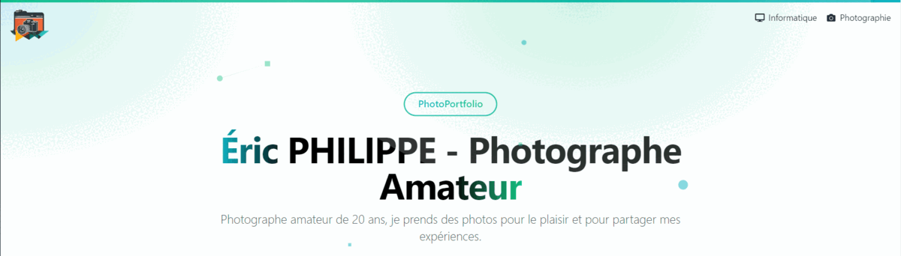
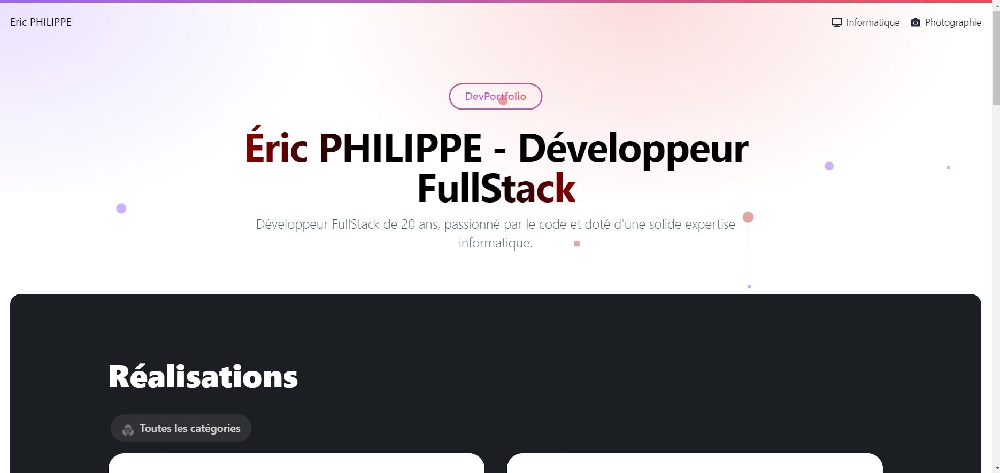
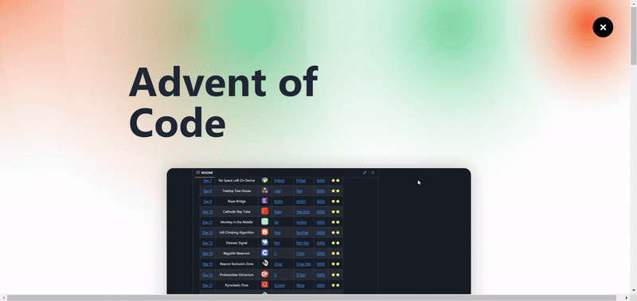
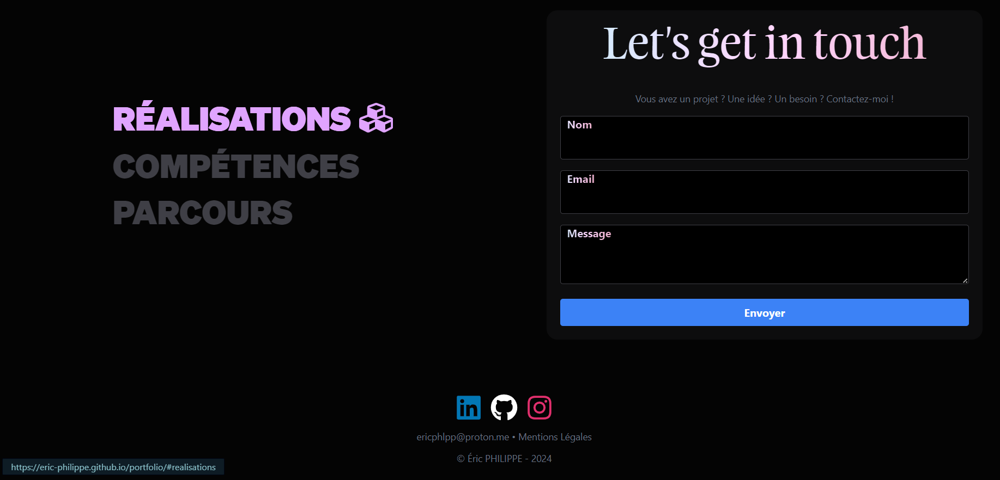
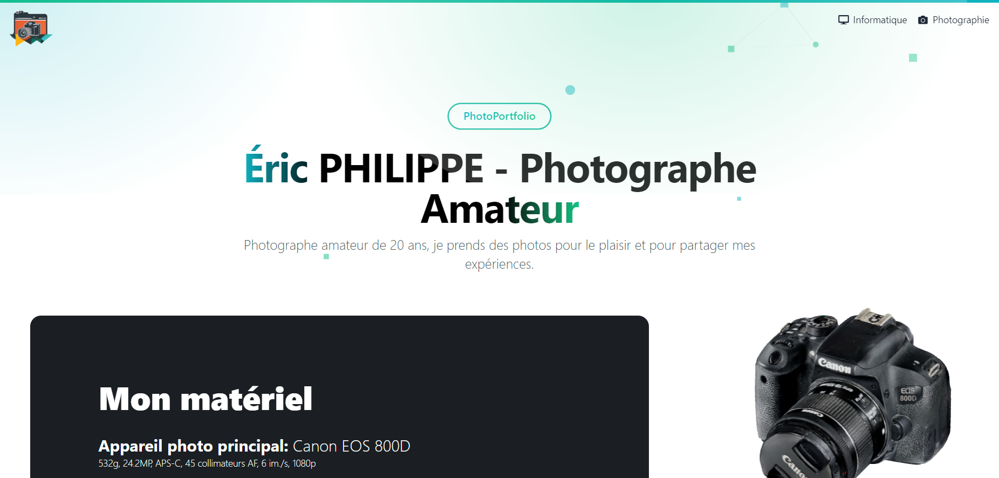

<div style="display: flex; align-items: center;">
    
    <h1>Eric Philippe - Photo/DevPortfolio</h1>
</div>

This repository contains the source code of my portfolio website.
It includes my DevPortfolio and my PhotoPortfolio, all in one !



<a href="https://actions-badge.atrox.dev/Eric-Philippe/portfolio/goto?ref=main"></a>

## Table of Contents

- [Eric Philippe - Photo/DevPortfolio](#eric-philippe---photodevportfolio)
  - [Table of Contents](#table-of-contents)
  - [About The Project](#about-the-project)
    - [Markdown Parser](#markdown-parser-📄)
    - [DevPortfolio](#devportfolio-💻)
    - [PhotoPortfolio](#photoportfolio-📷)
  - [Updates](#updates)
  - [Technologies](#technologies-📡)
  - [Continuous Integration](#continuous-integration)
    - [GitHub Actions](#github-actions)
    - [GitHub Pages](#github-pages)
  - [Getting Started](#getting-started)
    - [Node](#node-🟩)
      - [Prerequisites](#prerequisites)
      - [Installation](#installation)
      - [Usage](#usage)
    - [Docker](#docker-🐋)
      - [Prerequisites](#prerequisites-1)
      - [Installation](#installation-1)
    - [Usage](#usage)
  - [Authors](#authors)
  - [License](#license)

## About The Project

I wanted to put all my **creative** work in one place, and also make the process to **keep it up to date easier**. I also wanted to focus for once only and fully on the `Front-End` part of the website.

I also tried as my best to make the website fast and light, so that it can be accessible to everyone, keeping every files under 1MB.

### Markdown Parser 📄

The more I progressed in the development of this website, the more I realized that I needed a way to write my content in a more flexible way than HTML. This means that when I'm ready, I can concentrate on writing the content without having to worry about the layout.

After several iterations, I ended up writing my own Markdown Parser first in `Python`, then `Julia`. I chose Julia because it is a language that I wanted to learn, and it is also very fast.

Checkout the repository [here](https://github.com/Eric-Philippe/JuliaMarkdownJoy)

> At the end, you can find all the markdown files in the `_projects` folder.

### DevPortfolio 💻



This portfolio is a showcase of my work as a developer. It includes my projects, my skills, and my resume.

#### Projects 📁

The projects are written in markdown, and are located in the `_projects` folder. The parser will generate the content of the projects section from these files, during the CI/CD pipeline.

You can click on a project to see its details.



#### Skills 🧠

You'll then find a section with my skills. Nothing fancy here, just a list of skills with discrete animations.

#### About Me 🙋‍♂️

The about me section references my academic and career path, and also my resume. You can download it by clicking on the button.

#### Contact 📧

The contact section is a simple form that allows you to send me a message.



### PhotoPortfolio



This portfolio is a showcase of my work as a photographer. It includes my setup, my 3D models, and my albums.

#### Setup 📷

The setup section is a list of the equipment I use to take my photos. I used Three.js to render the 3D model of my camera. (Fancy, right ? :D)


#### Albums 📸

## W.I.P

## Updates

Every time I update the website, I keep up to date the [`CHANGELOG.md`](./CHANGELOG.md) file. You can check it out to see the latest updates.

Current version: `1.0.0`

## Technologies 📡

| Nom           | Description         | Version   |
| ------------- | ------------------- | --------- |
| `Node`        | Runtime             | `21.5.0`  |
| `React`       | Front-End Framework | `18.2.0`  |
| `Vite`        | Bundler             | `5.0.8`   |
| `TailwindCSS` | CSS Framework       | `3.4.0`   |
| `TypeScript`  | Language            | `5.2.2`   |
| `Three.js`    | 3D Library          | `0.160.0` |
| `Julia`       | Markdown Parser     | `1.10.0`  |

## Continuous Integration

### GitHub Actions

I use GitHub Actions to build the website and publish it on GitHub Pages. The CI/CD pipeline is defined in the [`ci-cd.yml`](./.github/workflows/ci-cd.yml) file.

### GitHub Pages

The website is hosted on GitHub Pages. The configuration is defined in the [`vite.config.ts`](./vite.config.ts) file.

## Getting Started

### Node 🟩

#### Prerequisites

- Node.js
- Julia (Optional, only if you want to use the Julia Markdown Parser)

#### Installation

1. Clone the repo

   ```sh
   git clone https://github.com/Eric-Philippe/portfolio.git
   ```

2. Install NPM packages
   ```sh
    npm install
   ```
   2.1 Install Julia packages (Optional)
   ```sh
    julia --project=. -e 'using Pkg; Pkg.instantiate()'
   ```

#### Usage

1. Start the development server
   ```sh
   npm run dev
   ```

> The website is now available at `http://localhost:5173/portfolio`

2. Build the website
   ```sh
   npm run build
   ```

### Docker 🐋

#### Prerequisites

- Docker

#### Installation

1. Clone the repo

   ```sh
   git clone https://github.com/Eric-Philippe/portfolio.git
   ```

2. Build the docker image
   ```sh
   docker build -t portfolio .
   ```
3. Run the docker image
   ```sh
   docker run -p 5173:5173 portfolio
   ```
   > The website is now available at `http://localhost:5173/portfolio`

## Authors

- **Eric Philippe** - [Eric-Philippe](https://github.com/Eric-Philippe)

## License

The portfolio is distributed under the GNU AFFERO GENERAL PUBLIC LICENSE. See `LICENSE` for more information.

It allows you to use, modify and distribute the code, as long as you make your modifications available to the public.
